# Connect RStudio to Git and GitHub {#rstudio-git-github}

Here we verify that RStudio can issue Git commands on your behalf. Assuming that you've gotten local Git to talk to GitHub, this means you'll also be able to pull from and push to GitHub from RStudio.

In later chapters and in live workshops˜, we revisit these operations with much more explanation.

If you succeed here, your set up is DONE.

## Prerequisites

We assume the following: 

  * You've registered a free GitHub account (chapter \@ref(github-acct)).
  * You've installed/updated R and RStudio (chapter \@ref(install-r-rstudio)).
  * You've installed Git (chapter \@ref(install-git)).
  * You've introduced yourself to Git (chapter \@ref(hello-git)).
  * You've confirmed that you can push to / pull from GitHub from the command line (chapter \@ref(push-pull-github)).

## Make a new repo on GitHub

Go to <https://github.com> and make sure you are logged in.

Click green "New repository" button. Or, if you are on your own profile page, click on "Repositories", then click the green "New" button.

Repository name: `myrepo` (or whatever you wish, we will delete this)  
Public  
YES Initialize this repository with a README

Click big green button "Create repository."

Copy the HTTPS clone URL to your clipboard via the green "Clone or Download" button. Or copy the SSH URL if you chose to set up SSH keys.

## Clone the new GitHub repository to your computer via RStudio

* In RStudio, start a new Project by going to *File > New Project* or Click *New Project* from the project menu at the top right. 
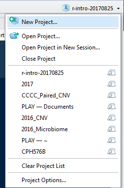

* Choose *Version Control*
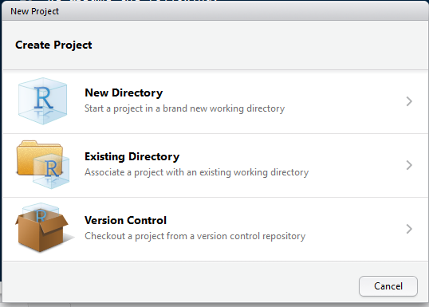

* Choose *Git*
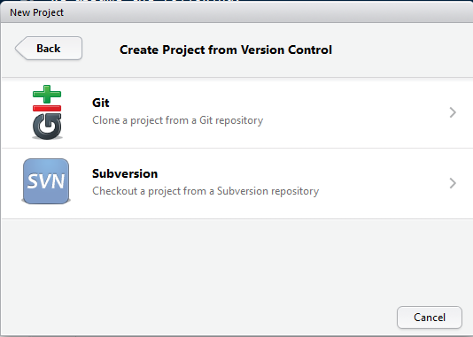
  
  * In the "repository URL" paste the URL of your new GitHub repository. It will be something like this `https://github.com/jennybc/myrepo.git`.
  * Take charge of -- or at least notice! -- the local directory for the Project. A common rookie mistake is to have no idea where you are saving files or what your working directory is. Pay attention. Be intentional.
  * I suggest you check "Open in new session", as that's what you'll usually do in real life.
  * Click "Create Project".
  
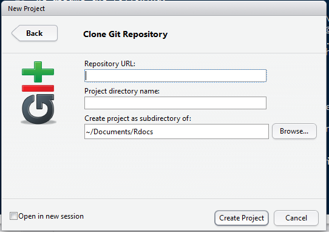

This should download the `README.md` file that we created on GitHub in the previous step. Look in RStudio's file browser pane for the `README.md` file.

## Make local changes, save, commit

From RStudio, modify the `README.md` file, e.g., by adding the line "This is a line from RStudio". Save your changes.

Commit these changes to your local repo. How?

From RStudio:

  * Click the *Git > Commit...* at the top of your screen.
  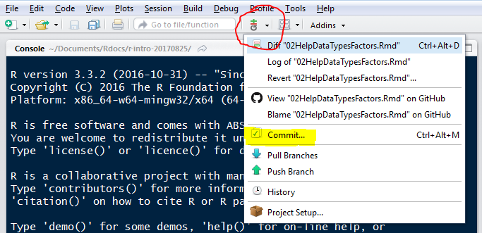
  
  * Check "Staged" box for your changed file.
  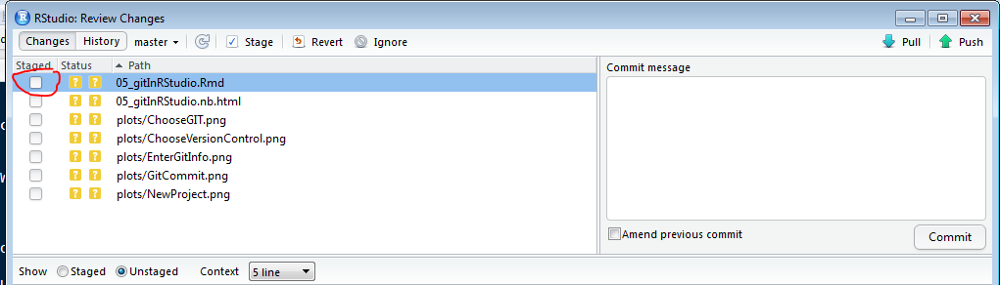
  * If you want a file to not be tracked by git, click the file, click the Ignore button, and click Save in the dialog box that opens (after making sure the filename is in the document, it should be added automatically)
  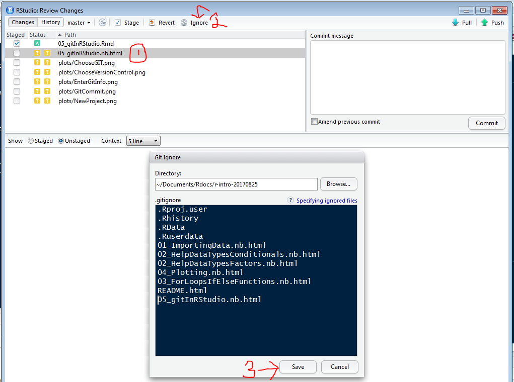
  

  * Type a message in "Commit message".
  * Click "Commit".
  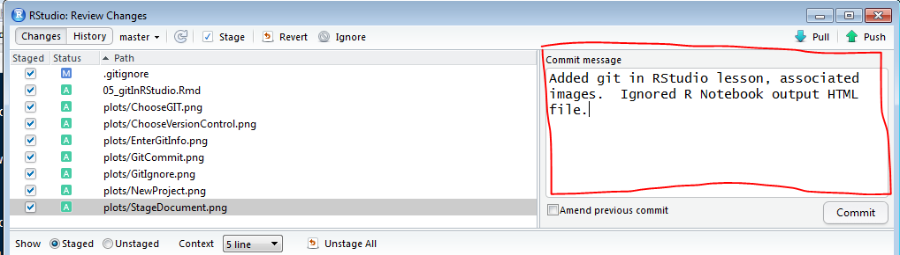
  
  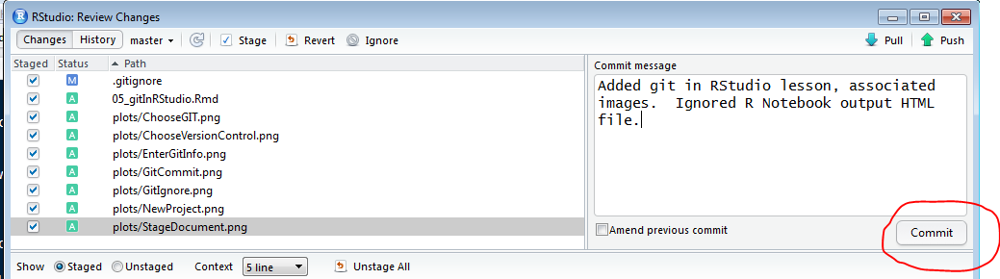
  
  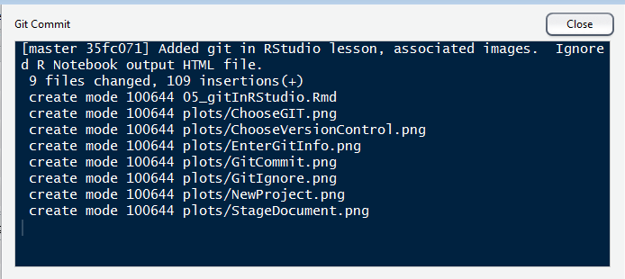

## Push your local changes online to GitHub
  
Click the green "Push" button to send your local changes to GitHub. 
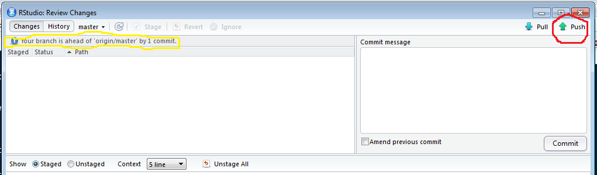

If you are challenged for username and password, provide them (but see below). You should see some message along these lines.
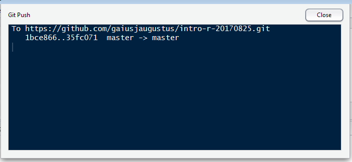

## Confirm the local change propagated to the GitHub remote

Go back to the browser. I assume we're still viewing your new GitHub repo.

Refresh.

You should see the new changes in your document.

If you click on "commits," you should see one with the message that you entered above.

If you have made it this far, you are DONE with set up. But first ...

## Were you challenged for GitHub username and password?

If you somehow haven't done so yet, now is the perfect time to make sure you don't need to keep providing username and password on each push.

Pick one:

  * Credential caching for HTTPS access, chapter \@ref(credential-caching).
  * Set up SSH keys, chapter \@ref(ssh-keys).

Now is the perfect time to do this, since you have a functioning test repo.

## Deleting a repo locally and remotely

**Local** When you're ready to clean up, you can delete the local repo any way you like. It's just a regular directory on your computer.

**GitHub** In the browser, go to your repo's landing page on GitHub. Click on "Settings".

Scroll down, click on "delete repository," and do as it asks.

Reference: [Connect Rstudio to Git and GitHub by Jenny Bryan](https://github.com/jennybc/happy-git-with-r/blob/master/13_connect-rstudio-git-github.Rmd)